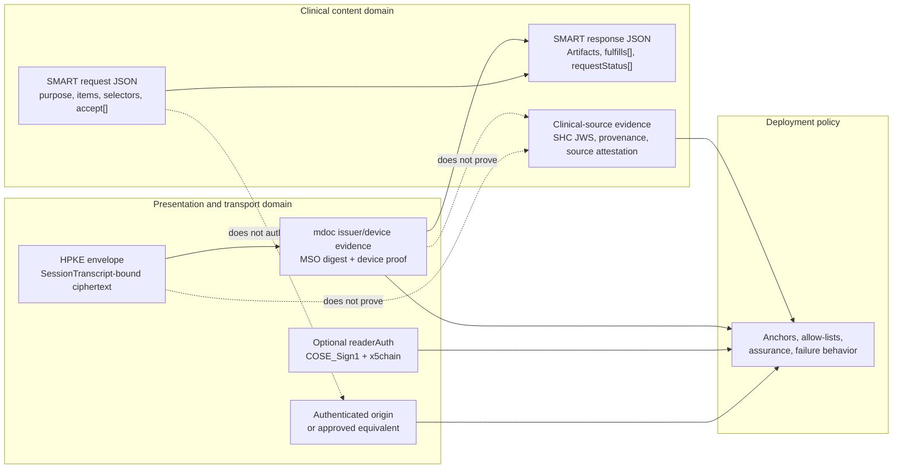
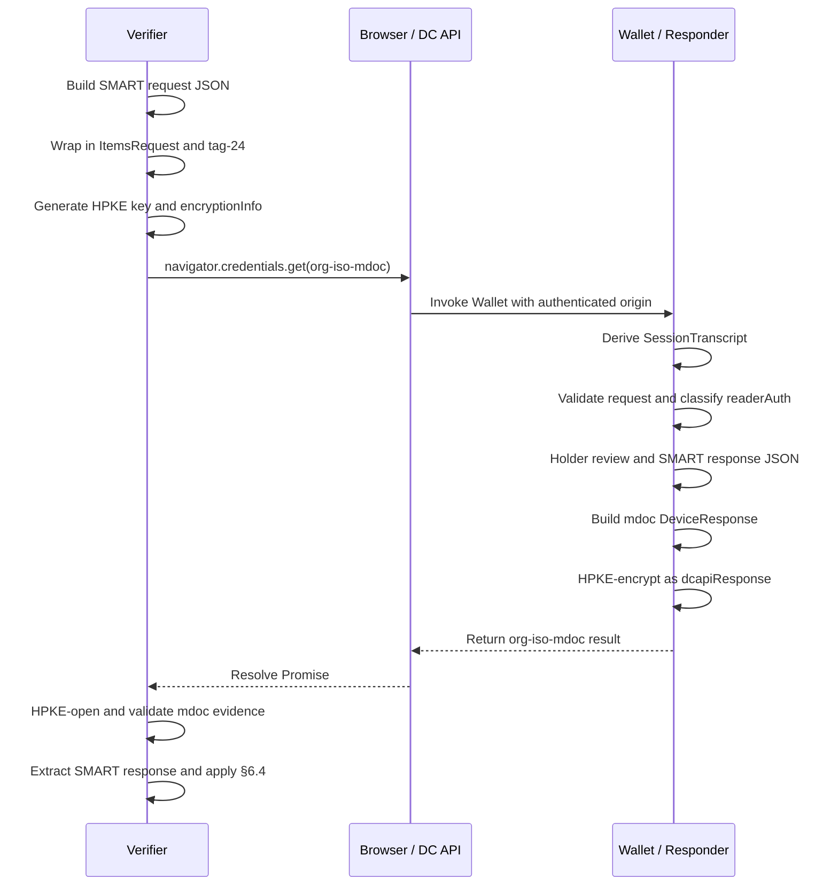

# SMART Health Check-in 1.0

A transport-neutral clinical request and response model for patient-mediated check-in, with a version 1.0 same-device presentation flow using direct `org-iso-mdoc` over the W3C Digital Credentials API.

Short title: **SMART Health Check-in 1.0**. Suggested citation label: **SHC-Checkin-1.0**. Suggested document identifier: `smart-health-checkin-1.0`.

---

## 0. Front Matter

Status: editor's draft for implementer review. Version: 1.0 draft. Publication metadata, editors, contributors, IPR statements, and final governance metadata are to be supplied by the publishing organization. Example identifiers, URLs, names, keys, and clinical data are illustrative unless explicitly identified as fixed protocol values.

**Editorial approach:** This candidate uses a docs-as-code style: brief narrative, TypeScript interfaces with normative JSDoc for the clinical data model, Mermaid diagrams for flow orientation, stable section numbers, and minimal examples. The main file preserves normative request/response rules, trust rules, same-device wire details, CDDL, and extension-point constraints. Tutorials, fixture indexes, byte ladders, JSON Schema artifacts, implementation notes, FHIR mapping walkthroughs, checklist extracts, and historical material are treated as companion material; normative implementation rules remain here.

Copyright and license terms are to be finalized before publication. The text is intended for CC BY 4.0 or a successor open documentation license; TypeScript interfaces, CDDL, pseudocode, and test scaffolding are intended for implementation and conformance testing under final package terms.

---

## 1. Introduction

SMART Health Check-in 1.0 defines a patient-mediated check-in profile in which a **Requester** asks a **Holder**, through a **Wallet/Responder**, to share workflow-bounded clinical or administrative content and receives a structured **SMART response**. Version 1.0 has two normative layers: the transport-neutral clinical JSON request/response model in §§5-6, and same-device direct `org-iso-mdoc` presentation over the W3C Digital Credentials API in §§7-8.

This profile uses W3C Digital Credentials API plus direct `org-iso-mdoc` because those are the practical rails available in 2026 across modern browsers, Android, iOS, and shipping wallet ecosystems. The mdoc layer is used as an authenticated, encrypted, holder-mediated transport for SMART clinical JSON. It is not used for mdoc-style per-element clinical selective disclosure or for defining clinical credential issuance. That is an unconventional use of mdoc, but it lets healthcare use deployed wallet/browser capabilities while keeping clinical semantics in FHIR-aware JSON.

The protocol is a request model, not a limit model. Selectors express what the Requester is looking for; they do not bound what a Wallet may return. Subject to Holder choice, Wallet policy, law, available data, `accept[]`, and validation, a response may disclose more, less, or different content than the selector text anticipated, and the response accounts for this with Artifacts, `fulfills[]`, and per-item status.

### 1.1 Core Trust Rule

SMART request and SMART response JSON are clinical content objects, not trust credentials. A component SHALL NOT treat `purpose`, item text, selector values, unknown request members, deployment handoff metadata, launch URLs, demo labels, Artifact ids, `fulfills[]`, `requestId`, successful HPKE opening, mdoc issuer/device evidence, optional `readerAuth`, Holder action, or syntactic response validity as a substitute for any other trust layer unless this specification or an explicit deployment profile defines that relationship and assurance level. Origin trust, reader/Verifier trust, issuer/device evidence, clinical-source provenance, Holder control, presentation freshness, patient matching, downstream authorization, and local clinical acceptance are separate decisions.

### 1.2 Why this design

Check-in workflows need a low-friction way for patients to move data from wallets and data sources into local clinical workflows. In 2026, browser-mediated wallet invocation and mdoc presentation are better deployed than healthcare-specific cross-vendor wallet protocols. This profile therefore standardizes the content model and the same-device presentation surface that can actually interoperate today.

The mdoc document contains one stable element, `smart_health_checkin_response`, whose value is the complete SMART response JSON. Disclosure granularity lives in the JSON layer: request items, Holder review, Artifacts, many-to-many `fulfills[]`, and the six status codes. This avoids projecting every FHIR resource, questionnaire, or status into mdoc element names and keeps FHIR validation in FHIR-aware software.

Cryptographic and platform evidence is still useful: DC API supplies caller context, HPKE protects the returned DeviceResponse, `SessionTranscript` binds the exchange to origin and encryption inputs, optional `readerAuth` can authenticate a Verifier key, and mdoc issuer/device evidence can authenticate the response carrier. None of those facts by itself establishes requester identity, patient match, clinical provenance, or downstream authorization.

### 1.3 Handoffs as on-ramps

Handoffs are deployment-defined ways to land the Holder in an authenticated web context that invokes `navigator.credentials.get` for `org-iso-mdoc`. Examples include a pre-visit SMS or email magic link, an in-clinic QR code, a patient-portal button, a kiosk pairing page, or a staff-assisted desktop sign. These mechanisms are product UX and operational workflow, not separate SMART Health Check-in wire protocols.

This boundary is deliberate. The W3C DC API call is the interoperability surface; everything before it may depend on local registration, patient-portal login, scheduling, signage, relays, or clinic workflow without changing the SMART request, SMART response, or same-device validation rules.

### 1.4 Deliberately out of scope

Version 1.0 does not standardize handoff URLs or relays, cross-device flows, credential issuance, Holder data-source synchronization, longitudinal Wallet storage, EHR write-back, payment adjudication, claims submission, patient matching, identity proofing, proxy authority, SMART App Launch replacement, general FHIR query, a trust framework, mdoc element-level clinical selective disclosure, or a new cryptographic-agility negotiation mechanism beyond existing wire-format algorithm identifiers. Products may implement these functions around the protocol, but they SHALL NOT change §§5-6 clinical semantics, §7 trust separation, or §8 same-device carriers and validation.

### 1.5 Companion material

Non-normative tutorials, fixture indexes, byte ladders, diagrams, platform implementation notes, worked examples, full wire captures, reference code, demo applications, detailed FHIR mapping walkthroughs, and historical captures should live as companion material outside the normative specification. Companion material MAY live in the same repository, linked documentation, a publication package, or another maintained location. It SHALL NOT redefine core fields, identifiers, algorithms, validation rules, selector semantics, status semantics, or trust boundaries.

---

## 2. Terminology and conventions

The key words **MUST**, **MUST NOT**, **REQUIRED**, **SHALL**, **SHALL NOT**, **SHOULD**, **SHOULD NOT**, **RECOMMENDED**, **NOT RECOMMENDED**, **MAY**, and **OPTIONAL** are interpreted as described in BCP 14, RFC 2119, and RFC 8174 when all capitals. JSON uses RFC 8259; CBOR uses RFC 8949; CDDL uses RFC 8610; COSE uses RFC 9052/9053; HPKE uses RFC 9180. Base64url fields use base64url without padding unless stated otherwise. Cryptographic operations use exact bytes named by the relevant section.

Key terms: **Artifact** is a response object with `id`, `mediaType`, `fulfills[]`, and media-type-defined payload fields. **Requester** constructs the SMART request and consumes the SMART response. **Verifier** invokes, opens, validates, and extracts from a presentation flow. **Holder** controls disclosure. **Wallet/Responder** reviews requests and returns responses. **SMART request** and **SMART response** are the JSON objects in §§5-6. **Same-device presentation flow** is the §8 direct `org-iso-mdoc` flow. **In-person handoff** is deployment UX that loads a same-device Verifier page, not a v1.0 wire format.

TypeScript interfaces and their accompanying JSDoc comments define the normative data model and field-level constraints. The TypeScript syntax expresses object shape, required versus optional members, literal discriminators, and discriminated unions; JSDoc comments carry normative processing requirements that TypeScript alone cannot enforce.

---

## 3. Architecture overview

### 3.1 What this profile standardizes

| Layer or role | Standardized here | Deployment policy or companion material |
| --- | --- | --- |
| Clinical request (§5) | `SmartHealthCheckinRequest`, items, display fields, `selection.fhir`, `form.fhir`, `accept[]`, canonical handling. | Workflow rationale, local UI copy, stricter profile limits. |
| Clinical response (§6) | `SmartHealthCheckinResponse`, Artifacts, media types, `fulfills[]`, status codes, many-to-many fulfillment, cross-validation. | Downstream ingestion, reconciliation, deduplication, retention, clinical sufficiency. |
| Trust (§7) | Separation of origin, reader, issuer/device, clinical-source, identifier, and deployment-policy layers. | Trust anchors, registries, allow-lists, assurance labels, patient matching, failure policy. |
| Same-device flow (§8) | Direct `org-iso-mdoc`, `docType`, namespace, stable element, request carrier, `SessionTranscript`, HPKE, mdoc validation, extraction. | Browser/wallet UX, production issuer onboarding, platform APIs, optional stricter constraints. |

The profile uses FHIR-native selectors where they fit: exact profile canonicals in `profiles[]`, profile-family canonicals in `profilesFrom[]`, official FHIR `resourceType` names in `resourceTypes[]`, and FHIR Questionnaire selection through `form.fhir`. `profiles[]` and `profilesFrom[]` are additive selectors, not narrowing selectors. Canonical `|version` handling is defined in §5.5.

### 3.2 mdoc primer for this profile

An mdoc is a CBOR-based mobile document format originally designed for mobile driver's licenses. It can carry issuer signatures over disclosed element values through a Mobile Security Object (MSO), bind disclosed values to value digests, and prove that the presenter possesses a device key bound into the document. ISO/IEC 18013-5 also defines request/response structures and authentication inputs used by wallet presentations.

SMART Health Check-in uses those presentation properties, but not mdoc's usual clinical data modeling. The Wallet places the complete SMART response JSON in one issuer-signed element named `smart_health_checkin_response`. The issuer signature therefore authenticates the wallet-side response carrier; clinical-source provenance remains inside Artifacts such as SMART Health Card JWS, FHIR Provenance, signed payloads, or deployment-approved source evidence.

Complete annotated byte ladders and worked captures are companion material. §8 contains the normative same-device construction and validation rules; Appendix A is only a diagnostic bridge for implementers who need to inspect CBOR boundaries.

## 4. Conformance

A conformance claim SHALL identify target(s), optional features, specification version, and any deployment profile that changes policy choices left open by this specification. One product MAY implement multiple targets, but it SHALL satisfy every requirement for each claimed target and optional feature.

| Target | Required behavior |
| --- | --- |
| Requester | Constructs §5 requests and asks only for Artifact media types it can parse, validate, and route. It keeps clinical request fields distinct from trust evidence and follows §5.2 request-body identity and trust-metadata constraints. |
| Verifier | Packages a SMART request, validates returned presentation artifacts, extracts the SMART response, and applies §6.4 against the original request before use. Direct `org-iso-mdoc` claims satisfy §8 Verifier obligations. |
| Wallet/Responder | Validates §5 requests, applies Holder control and Wallet policy at item granularity, preserves item ids, constructs §6 responses, and sets `requestId` to request `id`. Direct `org-iso-mdoc` claims satisfy §8 Wallet obligations. |
| Deployment/profile author | States constrained targets, required optional features, trust layers, and added validation/security/privacy/fixture expectations without redefining core clinical semantics, same-device carriers, trust-layer separation, or handoff UX. |
| Conformance/fixture author | Derives tests and fixtures from normative requirements and identifies target, optional feature, section, expected outcome, comparison mode, and demo trust status. |

Core clinical support includes fixed request/response `type` and `version`; request ids; item ids; display fields; `selection.fhir`; `form.fhir` with `questionnaireCanonical` and/or `questionnaire`; `profilesFrom[]` as an array; additive `profiles[]` plus `profilesFrom[]`; canonical `|version` handling; per-item `accept[]`; Artifact `mediaType`; no generic Artifact catch-all; `application/fhir+json` with `fhirVersion`; `application/smart-health-card` with `value.verifiableCredential[]` and no outer `fhirVersion`; exact `requestStatus[]` coverage; many-to-many fulfillment; and §6.4 cross-validation.

Optional features include reader authentication, extension selector kinds, extension Artifact media types, compatibility rules, future status-code extensions, stricter deployment validation profiles, fixture profiles, future `DeviceRequest` versions such as profile-defined `readerAuthAll`, and future bindings. An implementation claiming an optional feature SHALL implement its construction, processing, validation, unsupported behavior, security, privacy, and conformance rules. `readerAuth` is optional unless a deployment profile requires it; if present, Verifier SHALL construct it as §8 defines, and Wallet/Responder that supports or relies on it SHALL verify and classify it under §§7-8 and policy.

| Kind | Value |
| --- | --- |
| Request discriminator | `smart-health-checkin-request` |
| Response discriminator | `smart-health-checkin-response` |
| Request/response model version | `1` |
| Core selector kinds | `selection.fhir`, `form.fhir` |
| Core Artifact media types | `application/fhir+json`, `application/smart-health-card` |
| Core status codes | `fulfilled`, `partial`, `unavailable`, `declined`, `unsupported`, `error` |
| DC API protocol id | `org-iso-mdoc` |
| mdoc `docType` | `org.smarthealthit.checkin.1` |
| mdoc namespace | `org.smarthealthit.checkin` |
| mdoc stable response element | `smart_health_checkin_response` |
| SMART request carrier key | `org.smarthealthit.checkin.request` |

SMART Health Check-in 1.0 does not maintain a separate normative conformance checklist. Testable obligations can be extracted directly from §§5-9; conformance test authors are encouraged to derive assertions and fixtures from those requirements while identifying target, optional feature, section, expected outcome, comparison mode, and deployment-policy inputs.

---

## 5. Clinical Request Model

A SMART request is the transport-neutral clinical JSON object by which a Requester asks a Holder, through a Wallet/Responder, to share workflow-bounded content. Presentation transports may add origin, reader authentication, signatures, encryption, freshness, device evidence, routing identifiers, and validation artifacts; they do not change `purpose`, items, selectors, `accept[]`, item ids, or `required`.

### 5.1 Encoding rules

A SMART request SHALL be an RFC 8259 JSON object and, when serialized by a transport, SHALL be UTF-8. A Requester SHALL NOT include comments, trailing commas, duplicate object member names, `NaN`, `Infinity`, `-Infinity`, or non-JSON values. A Wallet/Responder or Verifier parsing a request SHALL reject a non-object top-level value or unparsable representation.

JSON member names SHALL be unique; duplicate names detected during parsing or validation SHALL cause rejection. Object member order has no clinical meaning. `fhirVersions[]` and `accept[]` are preference-ordered; `items[]` is preferred display/workflow order. The model defines no numeric fields; identifiers, versions, booleans, arrays, media types, FHIR canonicals, and display strings SHALL NOT be encoded as numbers. A Requester SHOULD keep values no larger than needed. Wallet/Responder MAY reject requests exceeding implementation, transport, safety, display, or policy limits.

A Wallet/Responder MAY ignore unknown members when they do not change known required-member meaning. A Requester SHALL NOT rely on unknown members to carry §5.2-prohibited identity/trust metadata, override Holder control, change `accept[]`, selector semantics, `required`, or transport/trust/consent behavior. Unknown `content.kind` values identify extension selector kinds and are not ignorable.

### 5.2 Normative TypeScript model

```typescript
export type NonEmptyString = string;
export type NonEmptyArray<T> = [T, ...T[]];
export type FhirCanonical = NonEmptyString;
export type FhirCanonicalUrl = NonEmptyString;
export type FhirRelease = NonEmptyString;
export type FhirResourceType = NonEmptyString;
export type MediaTypeString = NonEmptyString;

export interface SmartHealthCheckinRequest {
  /**
   * Request discriminator.
   * Requester SHALL set exactly "smart-health-checkin-request".
   * Wallet/Responder SHALL reject absent or different values.
   */
  type: "smart-health-checkin-request";

  /**
   * SMART request model version.
   * Requester SHALL set exactly "1".
   * Wallet/Responder SHALL reject absent or different values unless a future
   * compatibility rule applies.
   */
  version: "1";

  /**
   * Opaque Requester-generated request id.
   * SHALL be non-empty. Wallet/Responder SHALL preserve it exactly as response
   * `requestId`. Verifier SHALL compare it by exact string equality. It is a
   * correlation and referential-integrity value only.
   */
  id: NonEmptyString;

  /**
   * Optional Holder-facing workflow context.
   * SHALL NOT carry requester identity, organization, origin, logo/contact URL,
   * legal attestation, authority proof, consent language, trust status, or
   * persistent authorization. Wallet/Responder MAY display it but SHALL NOT
   * treat it as identity or trust.
   */
  purpose?: string;

  /**
   * Ordered FHIR release-version preferences, most preferred first.
   * Requester accepting `application/fhir+json` SHOULD include at least one
   * unless it can process any conforming version. Wallet/Responder SHOULD use
   * this list when choosing raw FHIR JSON versions, subject to Holder choice,
   * data, capability, policy, and `accept[]`.
   */
  fhirVersions?: FhirRelease[];

  /**
   * Request items in preferred display/workflow order.
   * Requester SHALL include an array and SHOULD include at least one item.
   * Wallet/Responder SHALL process items as Holder-review and
   * response-accounting granularity and MAY group, summarize, or reorder
   * display while preserving item ids.
   */
  items: SmartHealthCheckinRequestItem[];

  /**
   * Unknown members MAY be ignored only when they do not alter known semantics.
   * They SHALL NOT be used for requester identity, Holder-control override,
   * selector changes, media negotiation, consent, transport, or trust.
   */
  [extensionMember: string]: unknown;
}

export interface SmartHealthCheckinRequestItem {
  /**
   * Item id scoped to one request.
   * SHALL be a non-empty string unique within the request. Wallet/Responder and
   * Verifier SHALL compare by exact string equality and SHALL reject missing,
   * non-string, empty, or duplicate ids.
   */
  id: NonEmptyString;

  /**
   * Non-empty Holder-facing display title.
   * SHALL NOT substitute for authenticated requester identity.
   */
  title: NonEmptyString;

  /**
   * Optional Holder-facing explanation.
   * SHOULD clarify broad selectors, profile-family requests, or questionnaire
   * purpose. SHALL NOT substitute for authenticated requester identity.
   */
  summary?: string;

  /**
   * Advisory workflow context. Omitted means false.
   * SHALL NOT be treated as consent, authorization, a Wallet command, or a
   * fulfillment guarantee. Wallet/Responder SHALL NOT use `required: true` to
   * bypass Holder control, Wallet policy, law, or consent UX, and MAY return
   * declined, unavailable, unsupported, partial, or error for required items.
   */
  required?: boolean;

  /**
   * Selector object with a string `kind` discriminator.
   * Version 1.0 defines `selection.fhir` and `form.fhir`. Wallet/Responder
   * SHALL NOT infer unsupported selector semantics from display text or
   * unrelated fields; it SHALL reject the request or report `unsupported`.
   */
  content: Selector;

  /**
   * Accepted Artifact media types, most preferred first.
   * SHALL be a non-empty ordered array. Requester SHALL list only media types it
   * can parse, validate, and route. Wallet/Responder SHALL NOT return an
   * Artifact for this item unless its `mediaType` appears here, except under a
   * explicitly supported compatibility rule.
   */
  accept: NonEmptyArray<MediaTypeString>;

  [extensionMember: string]: unknown;
}

export type Selector =
  | SelectionFhirSelector
  | FormFhirSelector
  | ExtensionSelector;

export interface SelectionFhirSelector {
  /**
   * SHALL be exactly "selection.fhir".
   * This selector requests existing patient-specific FHIR resources.
   */
  kind: "selection.fhir";

  /**
   * Exact FHIR StructureDefinition canonical URLs.
   * Values MAY include `|version`. Wallet/Responder MAY match by `meta.profile`
   * or equivalent local/trusted conformance evidence; full profile validation
   * during matching is not required.
   */
  profiles?: NonEmptyArray<FhirCanonical>;

  /**
   * Canonical profile-family URL strings.
   * SHALL be a non-empty array when present. SHALL NOT be encoded as a string,
   * object, package descriptor, implementation-guide object, package id/version,
   * npm package name, registry alias, local topic vocabulary, or URN unless a
   * future version or extension defines that value space.
   */
  profilesFrom?: NonEmptyArray<FhirCanonicalUrl>;

  /**
   * Official FHIR resourceType names only.
   * SHALL NOT use local topic labels. With profile selectors this is an
   * additional constraint; without profile selectors it requests
   * patient-specific resources of the listed types.
   */
  resourceTypes?: NonEmptyArray<FhirResourceType>;

  /** SHALL NOT be present; use a separate `form.fhir` item for form completion. */
  questionnaireCanonical?: never;

  /** SHALL NOT be present; use a separate `form.fhir` item for form completion. */
  questionnaire?: never;

  [extensionMember: string]: unknown;
}

export interface FhirQuestionnaire {
  /** SHALL be exactly "Questionnaire". */
  resourceType: "Questionnaire";

  /** Optional FHIR canonical URL used when comparing to `questionnaireCanonical`. */
  url?: string;

  /** Optional FHIR version used when comparing to versioned canonicals. */
  version?: string;

  [fhirMember: string]: unknown;
}

interface FormFhirSelectorBase {
  /** SHALL be exactly "form.fhir". */
  kind: "form.fhir";

  /** SHALL NOT be present on `form.fhir`; use a separate `selection.fhir` item. */
  profiles?: never;

  /** SHALL NOT be present on `form.fhir`; use a separate `selection.fhir` item. */
  profilesFrom?: never;

  /** SHALL NOT be present on `form.fhir`; use a separate `selection.fhir` item. */
  resourceTypes?: never;

  [extensionMember: string]: unknown;
}

export interface FormFhirSelectorWithCanonical extends FormFhirSelectorBase {
  /**
   * Requester's explicit Questionnaire identity.
   * SHALL be non-empty when present and MAY include `|version`. Wallet/Responder
   * SHALL preserve it for canonical-version handling and generated
   * `QuestionnaireResponse.questionnaire` when known.
   */
  questionnaireCanonical: FhirCanonical;

  /**
   * Optional inline FHIR Questionnaire body to render or use.
   * If both fields are present, Requester SHOULD keep this resource's `url` and
   * `version` consistent with `questionnaireCanonical`.
   */
  questionnaire?: FhirQuestionnaire;
}

export interface FormFhirSelectorWithQuestionnaire extends FormFhirSelectorBase {
  /** Optional explicit Questionnaire identity; see `FormFhirSelectorWithCanonical`. */
  questionnaireCanonical?: FhirCanonical;

  /**
   * Inline FHIR Questionnaire body to render or use.
   * SHALL be a FHIR Questionnaire resource object with `resourceType`
   * "Questionnaire".
   */
  questionnaire: FhirQuestionnaire;
}

export type FormFhirSelector =
  | FormFhirSelectorWithCanonical
  | FormFhirSelectorWithQuestionnaire;

export interface ExtensionSelector {
  /**
   * Registered extension selector kind.
   * SHALL be a non-empty string other than "selection.fhir" or "form.fhir" and
   * SHALL be defined by a recognized extension before interoperable use.
   */
  kind: string;

  [extensionMember: string]: unknown;
}
```

A Requester SHALL NOT include self-asserted requester identity metadata in the SMART request body, including organization/facility names, logos/branding, URLs/callbacks/domains/origins/package names/app ids/certificates, signed-request/reader/Verifier/trust-framework/issuer/accreditation/legal-entity metadata, or pointer/relay/completion/encryption/nonce/handoff/wrapper metadata. Wallet/Responder SHALL NOT treat any request body field as authenticated requester identity unless established outside the body by presentation flow, trust processing, or policy.

### 5.3 Request item constraints

The TypeScript model in §5.2 defines request item fields, cardinality, and field-level constraints. Each request item is one unit of requested content or action and one unit of Holder review and response accounting. Requester SHALL include `id`, `title`, `content`, and non-empty `accept[]` on every item and MAY include `summary` and `required`.

### 5.4 Content selectors

Selectors express what the Requester is looking for; they do not bound what a Holder may disclose. Request breadth is deployment policy: broad or no-selector requests are valid protocol constructs when the Holder can make a meaningful choice. A Holder, through Wallet policy and choice, can disclose more, less, or different content than a selector names, but every returned Artifact-item edge still has to satisfy `accept[]`, status, validation, and §6.4. Selectors are not a general FHIR query language, authorization policy, patient-matching rule, requester identity channel, or clinical decision support expression. A Requester SHALL use a selector defined here or an explicitly supported extension. A Wallet/Responder SHALL evaluate selector semantics independently per item while allowing §6 many-to-many Artifact fulfillment.

#### 5.4.1 `selection.fhir`

For `selection.fhir`, if both `profiles[]` and `profilesFrom[]` are present, Wallet/Responder SHALL treat them as additive profile selectors: a resource matches if it matches any exact profile or any profile in any requested family, subject to `resourceTypes[]` and the rest of the item. Requester SHALL NOT rely on `profiles[]` to narrow `profilesFrom[]`; Wallet/Responder SHALL NOT interpret it that way.

If all `selection.fhir` selector arrays are omitted, the item asks the Wallet/Responder and Holder to decide what patient-specific FHIR resources, if any, are responsive for the check-in workflow, subject to `accept[]`, `fhirVersions[]` where applicable, capability, policy, and Holder decision. Wallet/Responder MAY fulfill it partially and is not required to disclose all resources.

#### 5.4.2 `form.fhir`

For `form.fhir`, a Wallet/Responder SHALL reject or report `unsupported` when neither form field is present, `questionnaireCanonical` is non-string or blank, `questionnaire` is not a Questionnaire, or `selection.fhir` fields are mixed in. Wallet/Responder MAY resolve `questionnaireCanonical` using configured resolvers, FHIR search, cache, Holder data source, or local mechanisms satisfying §5.4. Direct HTTP dereference is permitted only for unversioned canonicals. If it cannot resolve, render, or use the Questionnaire, it SHALL report an outcome under §6 rather than fabricating one. When both form fields are supplied, `questionnaireCanonical` is the Requester's explicit Questionnaire identity and the inline resource is the body to render or use. Wallet/Responder SHALL NOT silently merge conflicting definitions or silently rewrite the Requester's canonical. If it detects material disagreement, it SHOULD report `unsupported` or `error` rather than collecting ambiguous answers.

#### 5.4.3 Extension selectors

An extension/profile author SHALL define exact kind string, TypeScript/JSON shape, members, clinical meaning, content-satisfaction rules, interaction with `accept[]`, `fhirVersions[]`, canonicals, status and fulfillment, unsupported/unavailable/partial/error behavior, unknown-member handling, security and privacy considerations, and at least one example. It SHALL NOT redefine core fields, core selector kinds, Holder control, requester identity handling, canonical-version handling, or trust boundaries. Requester SHALL NOT use unsupported or private extension selectors when interoperable processing by unrelated Wallets/Responders is expected. Wallet/Responder that does not support an extension selector SHALL NOT guess semantics; it SHALL reject or report `unsupported`.

### 5.5 Canonical `|version` handling

A Requester MAY include `|version` where this section permits FHIR canonicals and SHOULD NOT include it in `profilesFrom[]` unless identifying a versioned profile family. Any processor of a FHIR canonical SHALL parse it into non-empty `url` and optional `version`: `url` is before the first `|`, or the entire string if absent; `version` is after the first `|`, with further `|` characters part of the opaque version. Implementations SHALL preserve the original wire string exactly for echoing, logging, response construction, fixtures, returned `Resource.meta.profile`, and generated `QuestionnaireResponse.questionnaire` when that canonical is the answered Questionnaire identity.

A Wallet/Responder or Verifier resolving a canonical SHALL use a configured resolver, package cache, terminology service, IG resolver, or FHIR search when available. FHIR search uses `GET [base]/{ResourceType}?url={url}&version={version}` for versioned canonicals and `GET [base]/{ResourceType}?url={url}` for unversioned. Direct HTTP dereference is permitted only for unversioned canonicals and only if returned resources pass verification. An implementation SHALL NOT satisfy a versioned canonical by stripping `|version` and directly dereferencing the bare URL.

After resolution, the implementation SHALL verify expected `resourceType`, `url` equal to parsed request `url`, and, for versioned requests, `version` equal to parsed request `version`; failure SHALL produce `unsupported` or `error` under §6. For versioned `profiles[]`, Wallet/Responder SHALL NOT report `fulfilled` unless returned `meta.profile` includes the same versioned canonical or equivalent exact-version evidence exists; Verifier SHALL apply the same exact-version rule. For unversioned `profiles[]`, matching any supported version of the base canonical is allowed subject to evidence and validation. Routing, grouping, profile-family lookup, and display MAY ignore `|version` only locally; they SHALL NOT rewrite exact-version evidence, response fields, diagnostics, or validation inputs.

### 5.6 Accepted media types

Requester SHALL include non-empty ordered `accept[]` on every item, encode each value as a media type string, order from most to least preferred, and list only media types it can parse, validate, and route. Wallet/Responder MAY return any listed type and SHOULD choose the earliest equivalent producible type. Wallet/Responder and Verifier SHALL enforce that every Artifact `mediaType` is accepted by every fulfilled item, except under an explicitly supported compatibility rule.

Core media types are `application/fhir+json` for raw FHIR JSON Resource or Bundle and `application/smart-health-card` for SMART Health Card file JSON. For `form.fhir` items, `application/fhir+json` normally carries a FHIR `QuestionnaireResponse`. Extension media types MAY be used when defined by an extension or agreed by deployment. Extension/profile authors SHALL define media type string, Artifact shape, processing, validation, security, privacy, FHIR-version handling if any, and compatibility with core media types if any.

---

## 6. Clinical Response Model

A SMART response is the transport-neutral JSON object by which a Wallet/Responder answers after Holder review, Wallet policy, and data-source availability. Transports may wrap, encrypt, authenticate, retain, or relay it, but do not change `requestId`, `artifacts[]`, `mediaType`, `fulfills[]`, or `requestStatus[]`.

### 6.1 Normative TypeScript model

```typescript
export interface SmartHealthCheckinResponse {
  /**
   * Response discriminator.
   * Wallet/Responder SHALL set exactly "smart-health-checkin-response".
   * Verifier SHALL reject absent or different values.
   */
  type: "smart-health-checkin-response";

  /**
   * SMART response model version.
   * Wallet/Responder SHALL set exactly "1". Verifier SHALL reject absent or
   * different values unless a future compatibility rule applies.
   */
  version: "1";

  /**
   * Correlates this response to the accepted request.
   * Wallet/Responder SHALL set exactly to `SmartHealthCheckinRequest.id`.
   * Verifier SHALL compare by exact string equality and reject mismatch.
   */
  requestId: NonEmptyString;

  /**
   * Returned clinical Artifacts.
   * MAY be empty when no item returns content, if `requestStatus[]` accounts for
   * every original request item. Each Artifact SHALL follow the common and
   * media-type-specific rules below.
   */
  artifacts: Artifact[];

  /**
   * Per-item outcomes.
   * SHALL include exactly one entry for every original request item and no
   * duplicate or unknown item ids, even when every item is fulfilled.
   */
  requestStatus: RequestItemStatus[];

  [extensionMember: string]: unknown;
}

export type Artifact =
  | SmartHealthCardArtifact
  | RawFhirJsonArtifact
  | ExtensionArtifact;

interface ArtifactBase {
  /**
   * Artifact id scoped to one response.
   * SHALL be non-empty and unique within the response. Verifier SHALL reject
   * missing, non-string, empty, or duplicate ids.
   */
  id: NonEmptyString;

  /**
   * Clinical response form.
   * SHALL be a non-empty media type string. Artifacts do not use a separate
   * protocol `type`. Verifier SHALL NOT treat unrecognized media types as
   * `GenericArtifact` or any other generic catch-all.
   */
  mediaType: MediaTypeString;

  /**
   * Original request item ids this Artifact fulfills.
   * SHALL be a non-empty array. Each value SHALL exactly equal one original
   * request item id. If one Artifact fulfills multiple items, its `mediaType`
   * SHALL be accepted by every fulfilled item.
   */
  fulfills: NonEmptyArray<NonEmptyString>;
}

export interface SmartHealthCardArtifact extends ArtifactBase {
  /** SHALL be exactly "application/smart-health-card". */
  mediaType: "application/smart-health-card";

  /**
   * SMART Health Card file payload.
   * SHALL contain a non-empty `verifiableCredential[]` array of SMART Health
   * Card Verifiable Credential JWS strings. Verifier/receiver SHALL verify and
   * process each JWS according to SMART Health Cards and local trust policy.
   */
  value: {
    verifiableCredential: NonEmptyArray<NonEmptyString>;
    [payloadMember: string]: unknown;
  };

  /**
   * SHALL NOT be present on SMART Health Card Artifacts.
   * FHIR version and issuer semantics are inside signed payloads.
   */
  fhirVersion?: never;
}

export interface FhirResource {
  /** SHALL be a FHIR resource type string. */
  resourceType: NonEmptyString;
  [fhirMember: string]: unknown;
}

export interface FhirBundle extends FhirResource {
  /** SHALL be exactly "Bundle" for Bundle payloads. */
  resourceType: "Bundle";

  /** Bundle entries when multiple resources are returned. */
  entry?: Array<{ resource?: FhirResource; [entryMember: string]: unknown }>;
}

export interface RawFhirJsonArtifact extends ArtifactBase {
  /** SHALL be exactly "application/fhir+json". */
  mediaType: "application/fhir+json";

  /**
   * FHIR release context for every resource in `value`.
   * SHALL be non-empty. Wallet/Responder SHALL NOT mix resources requiring
   * different FHIR releases in one Artifact. Verifier SHALL reject absent or
   * non-string values and SHOULD treat unaccepted releases as unsupported for
   * ingestion.
   */
  fhirVersion: FhirRelease;

  /**
   * Raw FHIR JSON payload.
   * SHALL be either a single FHIR Resource object with string `resourceType` or
   * a FHIR Bundle. Wallet/Responder SHOULD use a Bundle for multiple resources.
   * Returned FHIR `meta.profile` strings, including `|version`, SHALL be
   * preserved exactly and SHALL NOT be stripped or normalized.
   */
  value: FhirResource | FhirBundle;
}

export interface ExtensionArtifact extends ArtifactBase {
  /**
   * Registered extension media type or bounded media-type pattern.
   * Extension Artifacts MAY be returned only when accepted by every fulfilled
   * item and constructed under a recognized extension definition. The extension
   * SHALL define branded variant name, typed payload fields, encoding,
   * dereferencing/integrity, FHIR-version handling if any, status behavior,
   * validation, security, privacy, and compatibility. It SHALL NOT rely on
   * `GenericArtifact`, generic `value`/`url`/`data` semantics, or redefine
   * core response fields.
   */
  mediaType: string;

  [mediaTypeDefinedPayloadMember: string]: unknown;
}

export type RequestItemStatusCode =
  | "fulfilled"
  | "partial"
  | "unavailable"
  | "declined"
  | "unsupported"
  | "error";

export interface RequestItemStatus {
  /**
   * Original request item id.
   * SHALL exactly equal one `SmartHealthCheckinRequest.items[].id`.
   */
  item: NonEmptyString;

  /**
   * Version 1.0 item outcome code.
   * Wallet/Responder SHALL use only these six codes unless a future explicitly
   * supported extension is accepted by the receiving Verifier:
   * - `fulfilled`: item believed fully satisfied.
   * - `partial`: responsive content returned without complete fulfillment claim.
   * - `unavailable`: item understood/supported but no matching shareable content.
   * - `declined`: Holder declined or Wallet policy implemented Holder refusal.
   * - `unsupported`: item, selector, media type, Questionnaire, FHIR version, or
   *   extension semantics cannot be processed.
   * - `error`: operational or processing failure after the item was understood.
   */
  status: RequestItemStatusCode;

  /**
   * Optional concise explanation.
   * Wallet/Responder SHALL NOT include secrets, access tokens, stack traces,
   * unnecessary patient details, or unrelated Holder data. Receivers SHALL NOT
   * rely on localized text for normative status semantics.
   */
  message?: string;

  [extensionMember: string]: unknown;
}
```

### 6.2 Artifact and status semantics

Payload fields are media-type-specific. Verifier/receiver SHALL NOT infer dereferencing, decoding, signature, freshness, integrity, retention, expiration, or generic carrier semantics from field names alone. Raw `application/fhir+json` is patient-mediated unless separate accepted provenance, signature, source attestation, authenticated retrieval evidence, or equivalent proof is present. SMART Health Card Artifacts carry their FHIR version and issuer semantics inside signed credential payloads; wrapper-level profile summaries SHALL NOT be used as selector-conformance claims.

A `fulfilled` or `partial` status SHOULD have at least one Artifact whose `fulfills[]` includes the item unless an explicitly supported extension defines non-Artifact fulfillment. Verifier SHOULD flag inconsistent status-to-Artifact combinations under local policy.

### 6.3 Many-to-many fulfillment

Wallet/Responder MAY return one Artifact for multiple items or multiple Artifacts for one item. Every Artifact-item fulfillment edge SHALL satisfy media-type acceptance, FHIR-version, status-accounting, and validation rules. Wallet/Responder SHALL still include exactly one status entry per item. Verifier SHALL evaluate all Artifacts that list an item. A receiver MAY choose which valid Artifacts to ingest/display under local policy and SHALL NOT treat multiple Artifacts as a protocol error by itself.

### 6.4 Verifier cross-validation

Shape validation alone is insufficient. Verifier SHALL validate a SMART response against the original SMART request before use:

- `requestId` exactly matches the request `id`;
- every `fulfills[]` value resolves to exactly one original item id;
- every Artifact `mediaType` is a core or explicitly supported extension type;
- every Artifact-item edge uses a media type accepted by that item unless a supported compatibility rule applies;
- `requestStatus[]` covers every item exactly once and contains no unknown or duplicate item ids;
- raw FHIR Artifacts have non-empty `fhirVersion` and FHIR object `value`;
- Bundles do not mix FHIR releases;
- SMART Health Card Artifacts do not carry outer `fhirVersion`;
- any claim that an Artifact satisfies a versioned profile selector has exact-version evidence;
- returned `meta.profile` strings are preserved exactly; and
- response validation remains distinct from downstream clinical acceptance.

---

## 7. Trust Framework

Presentation-layer success does not establish requester identity, organizational identity, clinical-source provenance, patient matching, downstream authorization, or EHR write-back permission. Each signal proves only what it proves, and §1.1 controls when a component is tempted to substitute one signal for another. Per §5.2, requester identity, origin, reader credentials, and trust metadata are not carried in the SMART request body.



Available signals include:

- **Authenticated origin or approved equivalent:** caller context supplied by the Browser/User Agent, Credential Manager, platform channel, or privileged-caller mechanism. It is not derived from request JSON, display strings, callback-looking values, handoff metadata, or Artifact payloads.
- **Optional reader authentication:** a per-`DocRequest.readerAuth` `COSE_Sign1` over the same `SessionTranscript` and exact tag-24 `ItemsRequest` bytes. Wallet/Responder implementations that support or rely on it verify signature, detached-payload binding, `x5chain` or key evidence, and deployment policy under §8, and distinguish absent, malformed, cryptographically failed, valid-but-untrusted, and trusted states.
- **mdoc issuer/device evidence:** validation can show that the stable response element matched an MSO value digest, that `issuerAuth` signed the MSO, and that the presenter possessed the device key for the expected `SessionTranscript`. Anchor acceptance, accreditation, revocation, and assurance labels are deployment policy.
- **Clinical-source evidence:** SMART Health Card JWSs, FHIR `Provenance`, signed payloads, authenticated retrieval evidence, or extension-defined proofs inside Artifacts. Raw `application/fhir+json` remains patient-mediated unless separate accepted evidence supplies provenance.

Protocol-layer certificates may be self-signed. SMART Health Check-in does not require both parties to belong to a shared trust framework before exchange; its job is to enable willing parties to exchange data when the end user makes that happen. Trust frameworks, anchor lists, registries, allow-lists, assurance labels, patient-matching rules, and failure behavior are deployment policy layered on top. A deployment profile adding trust requirements SHALL document constrained roles, mandatory trust layers, accepted anchors/registries/allow-lists/policies/provenance mechanisms, freshness/revocation/replay/status expectations, Holder display distinctions, and behavior when a presentation succeeds but downstream policy fails.

---

## 8. Same-device Presentation Flow

This section defines the base v1.0 live presentation flow; complete byte ladders and annotated wire captures are companion material. Verifier carries a §5 request through W3C Digital Credentials API direct `org-iso-mdoc`; Wallet/Responder returns a §6 response inside an mdoc `DeviceResponse` encrypted for Verifier. This is the only normative v1.0 presentation flow. Handoffs MAY load a same-device Verifier page; their URL formats, relay behavior, storage, and completion handling are outside this specification.



### 8.1 Identifiers and constants

| Purpose | Value |
| --- | --- |
| DC API protocol | `org-iso-mdoc` |
| mdoc `docType` | `org.smarthealthit.checkin.1` |
| mdoc namespace | `org.smarthealthit.checkin` |
| Element | `smart_health_checkin_response` |
| Request carrier | `ItemsRequest.requestInfo["org.smarthealthit.checkin.request"]` |

Verifier SHALL use the protocol, `docType`, namespace, element, and request-carrier identifiers in this table exactly. Except for the temporary platform-mediation compatibility duplicate in §8.2, Verifier SHALL carry the SMART request only as a JSON string in the request carrier. Wallet/Responder SHALL NOT treat other dynamic element names, wrappers, archived experiments, or other locations as v1.0 request carriers. Wallet/Responder SHALL carry the SMART response as `elementValue` of an issuer-signed item in namespace `org.smarthealthit.checkin` with element identifier `smart_health_checkin_response`.

Baseline algorithm support is separate from fixed protocol identifiers. Implementations claiming same-device support SHALL support ES256 / COSE `alg` `-7`, SHA-256 MSO value digests, and HPKE DHKEM(P-256, HKDF-SHA256), HKDF-SHA256, AES-128-GCM. A deployment profile MAY allow other COSE, digest, or HPKE algorithms when both parties support them through the corresponding COSE, MSO, HPKE, `encryptionInfo`, and `dcapiResponse` identifiers. Unsupported or unilateral choices SHALL be rejected; implementations SHALL NOT silently downgrade, ignore labels, or substitute defaults.

### 8.2 Verifier request construction

Verifier SHALL serialize the §5 SMART request as UTF-8 JSON text and place it at `ItemsRequest.requestInfo["org.smarthealthit.checkin.request"]` as a CBOR text string, not a CBOR map or base64url JSON. Core `ItemsRequest` SHALL have `docType` `org.smarthealthit.checkin.1`, namespace `org.smarthealthit.checkin`, element `smart_health_checkin_response`, and the request carrier. The namespace boolean is mdoc `intentToRetain`; Verifier SHALL default it to `true` and MAY set `false` only for true ephemeral use when policy permits. It does not override Holder choice, Wallet policy, law, privacy, or downstream retention. Verifier SHALL NOT model FHIR profiles, items, questionnaires, media types, status codes, or resources as separate mdoc elements.

**Temporary platform-mediation compatibility carrier.** Some platform-mediated mdoc presentment flows expose requested `docType`, namespaces, and element identifiers to wallet code before response construction, while arbitrary `ItemsRequest.requestInfo` contents may be unavailable at that point. During this compatibility period, Verifier MAY also request a companion element in namespace `org.smarthealthit.checkin` with element identifier `smart_request_b64u.<base64url-without-padding(UTF-8 SMART request JSON)>` and `intentToRetain=false`. The canonical request carrier remains `ItemsRequest.requestInfo["org.smarthealthit.checkin.request"]`. Wallet/Responder SHOULD prefer `requestInfo`, MAY fall back to the companion element only when `requestInfo` is unavailable, and SHALL reject the request if both carriers are present but their SMART request JSON strings differ. This companion element is a duplicate compatibility population, not a long-term replacement for `requestInfo`.

Verifier SHALL CBOR-encode `ItemsRequest` and wrap bytes in CBOR tag 24 before placing in `DocRequest.itemsRequest`. Verifier SHALL construct baseline `DeviceRequest` version `1.0` with a `docRequests` array containing the SMART Health Check-in `DocRequest`. Core v1.0 uses optional per-`DocRequest.readerAuth`; profiles MAY use future ISO-compatible versions such as v1.1 `readerAuthAll` when both parties support the profile and it does not change SMART JSON semantics.

If Verifier includes `readerAuth`, it SHALL support detached ES256 (`alg` `-7`) `COSE_Sign1` and MAY use another algorithm when both parties support it through COSE algorithm identifiers and policy. It constructs `COSE_Sign1` over `tag24(CBOR(["ReaderAuthentication", SessionTranscript, ItemsRequestBytes]))`. For the baseline ES256 profile, the protected header includes `{1: -7}`; serialized payload field SHALL be `null`; COSE signature input SHALL use empty external AAD and the ReaderAuthentication bytes as detached payload; header label `33` (`x5chain`) SHALL carry at least the leaf reader certificate. Verifier SHALL compute it for exact `SessionTranscript` and exact `ItemsRequestBytes` and SHALL NOT reuse across sessions, origins, encryption information, request serializations, or element sets.

For each request, Verifier SHALL support baseline DHKEM(P-256, HKDF-SHA256) HPKE recipient key material and SHOULD use a fresh key pair. It MAY use another HPKE suite when both parties support it through the suite identifiers in `encryptionInfo`/`dcapiResponse` and policy. Reuse-permitting profiles SHALL define replay/correlation/retention/compromise handling. `encryptionInfo` SHALL be CBOR `["dcapi", {"nonce": fresh unpredictable bytes, "recipientPublicKey": <suite-appropriate recipient public key>}]`. For the baseline suite, `recipientPublicKey` is a P-256 COSE_Key with labels `1:2`, `-1:1`, `-2`, and `-3`; other profile-supported suites SHALL define the corresponding key representation. Nonce SHOULD have at least 16 bytes of entropy. Verifier SHALL retain private key and exact `encryptionInfo` CBOR until processing completes or session is abandoned. Verifier SHALL base64url-encode CBOR `DeviceRequest` and `encryptionInfo` without padding and preserve exact `encryptionInfo` base64url string for §8.3.

### 8.3 `SessionTranscript`

Both sides SHALL compute direct `dcapi` transcript bytes:

```text
dcapiInfo = CBOR([encryptionInfoBase64Url, origin])
handover = ["dcapi", SHA-256(dcapiInfo)]
SessionTranscript = CBOR([null, null, handover])
```

`encryptionInfoBase64Url` is the exact unpadded request string. `origin` is authenticated origin or deployment-approved privileged-caller origin-equivalent supplied by Browser/User Agent or platform. Wallet/Responder SHALL obtain origin from authenticated platform sources and SHALL NOT derive it from request JSON, display text, selector URLs, ids, handoff metadata, callback-looking strings, or Artifact contents. Verifier, Wallet/Responder SHALL use the same transcript for `readerAuth`, HPKE, and device authentication as applicable. If origin/equivalent is unavailable, Wallet/Responder SHALL treat origin trust as absent and SHALL NOT substitute a self-asserted request field.

### 8.4 Wallet request handling and response construction

Wallet/Responder receiving candidate direct `org-iso-mdoc` SHALL validate before response construction: protocol; base64url/CBOR `DeviceRequest`; supported `DeviceRequest.version` (baseline `1.0`); tag-24 `ItemsRequest`; exact tag bytes for `readerAuth`; `ItemsRequest.docType`; namespace/element and `intentToRetain`; request carrier string; §5 SMART request; base64url/CBOR direct `dcapi` `encryptionInfo`; recipient key and HPKE suite that are either baseline P-256 or a mutually supported alternative; and §8.3 transcript using exact `encryptionInfo` string and authenticated origin/equivalent. If request JSON is absent, not a string, unparsable, non-object, or invalid, Wallet/Responder SHALL reject, report failure, or fail safely and SHALL NOT infer clinical semantics from mdoc names, display strings, archived encodings, unknown fields, or wrappers.

If `readerAuth` is present and Wallet supports or relies on it, Wallet/Responder SHALL verify detached `COSE_Sign1`, protected algorithm, `ReaderAuthenticationBytes`, transcript, exact tag-24 `ItemsRequestBytes`, signature, `x5chain`, and deployment policy. It SHALL distinguish absent, malformed, cryptographically failed, valid-but-untrusted, and trusted states. After validation, Wallet/Responder SHALL perform Holder review or equivalent Holder-control at item granularity and preserve item ids. It MAY group/summarize/reorder/suppress display for accessibility, safety, localization, policy, or law, but SHALL NOT treat `required: true` as consent or present request text as authenticated identity.

Wallet/Responder that proceeds SHALL construct a §6 SMART response with `requestId` exactly equal to accepted request `id`. It SHALL serialize response as UTF-8 JSON and create an `IssuerSignedItem` in namespace `org.smarthealthit.checkin` with `digestID`, `random`, `elementIdentifier: "smart_health_checkin_response"`, and `elementValue` as the JSON string. It SHALL CBOR-encode and tag-24-wrap the item, place it in `issuerSigned.nameSpaces["org.smarthealthit.checkin"]`, and compute MSO value digest over complete tag-24 bytes. `digestID` SHALL match the MSO `valueDigests` key. Wallet/Responder SHALL construct an MSO with `docType` `org.smarthealthit.checkin.1`, value digest for the stable item, and `deviceKeyInfo.deviceKey`. It SHALL support MSO value digests using SHA-256 and MAY use another digest when both parties support it through the MSO `digestAlgorithm` field and policy. It SHALL sign the MSO as `issuerAuth` using ES256 (`alg` `-7`) as baseline, or another mutually supported COSE algorithm carried in the COSE algorithm identifier.

Wallet/Responder SHALL construct `DeviceAuthentication` over `tag24(CBOR(["DeviceAuthentication", SessionTranscript, "org.smarthealthit.checkin.1", tag24(CBOR(DeviceNameSpaces))]))` and produce device `COSE_Sign1` using ES256 as baseline, or another mutually supported COSE algorithm carried in COSE algorithm identifiers, signed with the private key corresponding to `MSO.deviceKeyInfo.deviceKey`. For core profile, `DeviceNameSpaces` is normally empty unless a deployment profile defines additional device-signed elements; the SMART response remains issuer-signed. Wallet/Responder SHALL construct a `DeviceResponse` version `1.0` with success status, document `docType` `org.smarthealthit.checkin.1`, issuer-signed stable item, `issuerAuth`, device-signed namespaces, and device signature.

### 8.5 HPKE encryption and Verifier processing

Wallet/Responder SHALL support encrypting CBOR `DeviceResponse` plaintext to the recipient public key from `encryptionInfo` using HPKE base mode with KEM DHKEM(P-256, HKDF-SHA256), KDF HKDF-SHA256, AEAD AES-128-GCM, `info = SessionTranscript bytes`, and empty `aad`. It MAY use another HPKE suite only when both parties support it through the suite identifiers in the wire structures and policy. It SHALL wrap HPKE output as CBOR `["dcapi", {"enc": bstr, "cipherText": bstr}]`, base64url-encode without padding, and return DC API result with `protocol: "org-iso-mdoc"` and `data.response`. Wallet/Responder SHALL NOT return plaintext `DeviceResponse`, plaintext SMART response JSON, another carrier, non-empty AAD, or unilateral/unsupported algorithm choices.

Verifier SHALL require returned protocol `org-iso-mdoc`, unpadded base64url `data.response`, direct CBOR `dcapiResponse`, expected transcript from original exact `encryptionInfo` and origin, HPKE opening with retained private key and the suite signaled by Wallet/Responder (baseline or mutually supported alternative), CBOR `DeviceResponse` version `1.0` with success status, document `docType`, valid `issuerAuth` and MSO under §7/policy, stable disclosed item, value digest over exact tag-24 item bytes, valid device signature over expected `DeviceAuthentication`, string `elementValue`, §6 SMART response validation, and §6.4 cross-validation. Verifier SHALL reject or quarantine on failure and SHALL keep HPKE, origin, readerAuth, issuer/MSO, device proof, response syntax, and clinical-source trust decisions distinct.

### 8.6 Validation checklist

Verifier implementing same-device `org-iso-mdoc` SHALL validate original §5 request, request construction identifiers, tag-24 `ItemsRequest`, direct `dcapi` `encryptionInfo`, transcript, required readerAuth if policy demands, returned wrapper, HPKE, `DeviceResponse`, issuer/MSO, digest binding, stable element, device proof, extracted §6 response, §6.4 checks, and §7 trust interpretation. Wallet/Responder SHALL validate request wrapper, DeviceRequest, ItemsRequest, request carrier, §5 request, transcript, readerAuth classification, Holder control, §6 response, stable issuer-signed element, MSO, device authentication, DeviceResponse, HPKE encryption, and outer result. Deployment profiles SHOULD define additional origin, browser, readerAuth, certificate, revocation, issuer anchor, self-attestation, nonce, replay, fixture, size, duplicate, display, logging, telemetry, and clinical-source acceptance requirements.

---

## 9. Security, Privacy, Extension Points, and Internationalization

### 9.1 Security considerations

Verifier MUST NOT accept plaintext `DeviceResponse`, plaintext SMART response JSON, a response whose HPKE context is not bound to the expected `SessionTranscript`, or a unilateral algorithm substitution. Baseline support is ES256 / COSE `alg` `-7`, MSO `digestAlgorithm` `SHA-256`, and HPKE DHKEM(P-256, HKDF-SHA256), HKDF-SHA256, AES-128-GCM. Profiles MAY allow additional algorithms using existing COSE, MSO, and HPKE wire identifiers when both parties support them. Unknown, unsupported, or unexpected labels SHALL be rejected; implementations SHALL NOT silently downgrade, ignore labels, or substitute library defaults.

Freshness is supplied by §8 session mechanisms, not request ids, item ids, Artifact ids, or handoff handles. Verifier SHOULD use a fresh HPKE recipient key pair and nonce per session; profiles that permit reuse need replay, correlation, retention, and compromise rules. Requesters/Verifiers should reject stale, duplicate, mismatched, or superseded responses.

Wallet/Responder supporting or relying on reader authentication SHALL verify signature, detached-payload binding, protected algorithm, signing key, certificate/key evidence, transcript, exact `ItemsRequest`, and policy before treating a reader as authenticated. It SHALL distinguish absent, malformed, cryptographically failed, valid-but-untrusted, and trusted states.

Verifier SHALL complete §8 mdoc validation and deployment issuer/device policy before claiming production issuer trust. Syntactically valid MSO, matching digest, signature against an included certificate, device proof, HPKE success, origin binding, readerAuth validation, or request-id match does not by itself prove production accreditation, patient matching, clinical correctness, source provenance, downstream authorization, or EHR write-back permission.

Per §5.2, requester identity, origin, reader credentials, and trust metadata are not carried in the SMART request body. Security decisions that depend on those signals come from presentation flow evidence, trust processing, or deployment policy.

### 9.2 Privacy considerations

Minimization is deployment guidance that profiles may strengthen: many workflows should request narrow items, selectors, media types, and FHIR versions, while some legitimate check-in workflows need broad requests. Wallet/Responder SHALL preserve item ids and provide Holder review or equivalent Holder-control at item granularity before disclosure unless an explicit profile defines another mechanism. Non-fulfilled statuses are normal outcomes; Requesters should avoid inferring undisclosed clinical facts.

Selective disclosure occurs through item boundaries, Wallet policy, Holder decisions, Artifact construction, media types, `fulfills[]`, and status. The same-device binding carries one stable mdoc element; it does not model each clinical subcomponent as a separate mdoc element. Identifiers in this profile (request `id`, item ids, Artifact ids, and `requestId`) are scoped correlation and referential-integrity values. Participants should avoid embedding patient identifiers, account numbers, MRNs, source-system ids, secrets, predictable sequences, or clinical facts in protocol identifiers, since these values may appear in logs, diagnostics, audit records, and telemetry.

Telemetry SHOULD prefer aggregate counts, coarse categories, sampling, redaction, scoped identifiers, and short retention. Routine telemetry SHOULD NOT include plaintext protocol payloads, clinical content, Holder decisions, DeviceResponse plaintext, dcapi internals, HPKE values, request-opening private keys, Wallet secrets, credentials, access tokens, bearer URLs, full launch URLs, full QR images, or sensitive stack traces except under controlled diagnostic, fixture, audit, or incident-response procedures.

### 9.3 Identifiers and extension points

SMART request/response discriminators are protocol constants, not media types, mdoc identifiers, JOSE `typ`, or profile ids. Media type strings in `accept[]` and `mediaType` are compared by exact, case-sensitive equality unless an explicitly supported extension says otherwise.

| Media type | Use |
| --- | --- |
| `application/fhir+json` | Core Artifact media type for raw FHIR JSON Resource or Bundle; Artifact carries `value` and outer `fhirVersion`. |
| `application/smart-health-card` | Core Artifact media type for SMART Health Card file JSON with `value.verifiableCredential[]`; no outer `fhirVersion`. |

Future Artifact media-type extensions SHALL define exact string, payload shape, fields, encoding, dereferencing/integrity, FHIR-version semantics if any, validation, status interaction, security, privacy, and compatibility. Extensions SHALL NOT introduce `GenericArtifact` or any other generic catch-all Artifact, and SHALL NOT redefine core fields.

The same-device binding uses `org-iso-mdoc`, `org.smarthealthit.checkin.1`, `org.smarthealthit.checkin`, `smart_health_checkin_response`, and `org.smarthealthit.checkin.request` exactly as §8 defines. Future incompatible carrier changes SHOULD use a new profile identifier and, when necessary, new `docType` suffix.

Version 1.0 status codes are `fulfilled`, `partial`, `unavailable`, `declined`, `unsupported`, and `error`. Version 1.0 selector kinds are `selection.fhir` and `form.fhir`. New status codes, selector kinds, Artifact media types, profile identifiers, or future mdoc identifiers SHALL NOT redefine core semantics, Holder control, trust separation, or validation.

Profile identifiers are not SMART request fields, response fields, selectors, media types, status codes, request presets, IPS shortcuts, all-of-the-above shortcuts, topic labels, or substitutes for §5 selectors. A profile identifier SHALL NOT be placed inside a SMART request to bypass selectors, `accept[]`, response validation, trust processing, or §8 validation.

### 9.4 Internationalization

Human-readable display text includes `purpose`, item `title`, item `summary`, `requestStatus[].message`, Questionnaire text, FHIR displays, UI prompts/warnings/errors, and extension fields defined as display text. Protocol identifiers and machine values are not localized, including ids/constants, status codes, selector kinds and values, media types, FHIR canonicals/resource types used for validation, mdoc ids, algorithm labels, and deployment-local launch identifiers/URLs.

SMART Health Check-in 1.0 does not define core `lang`, `locale`, `Accept-Language`, language maps, negotiated-locale members, or locale parameters. Producers associating language tags with display text SHOULD use well-formed BCP 47 tags. FHIR content follows applicable FHIR i18n/localization. Translation, grouping, reordering, or display normalization SHALL NOT change protocol values used for construction, signatures, hashing, encryption, HPKE/HKDF inputs, COSE, mdoc digests, SHC verification, FHIR canonical preservation, audit records, or byte-exact fixtures.

UIs SHOULD isolate untrusted display text from adjacent labels, origins, identifiers, URLs, profile canonicals, media types, status badges, trust indicators, warnings, and action buttons. Unicode and BIDI rendering SHALL NOT allow display text to spoof or obscure protocol identifiers, origins, identities, profile URLs, FHIR canonicals, mdoc identifiers, provenance, trust, status codes, validation outcomes, Holder decisions, or consent controls.

---

## Appendix A. Same-device diagnostic bridge

This non-normative appendix visualizes byte boundaries and SMART-specific constraints already specified in §8. ISO/IEC 18013-5 owns the base CDDL; if it conflicts with §8, §8 controls. Complete wire captures and byte ladders belong in companion material.

### A.1 Fixed identifiers

```text
smart-protocol-id        = "org-iso-mdoc"
smart-doc-type           = "org.smarthealthit.checkin.1"
smart-namespace          = "org.smarthealthit.checkin"
smart-response-element   = "smart_health_checkin_response"
smart-request-info-key   = "org.smarthealthit.checkin.request"
smart-request-companion-prefix = "smart_request_b64u."
dcapi-label              = "dcapi"
```

### A.2 Digital Credentials API wrappers

```json
{
  "protocol": "org-iso-mdoc",
  "data": {
    "deviceRequest": "<base64url-without-padding CBOR DeviceRequest>",
    "encryptionInfo": "<base64url-without-padding CBOR encryptionInfo>"
  }
}
```

```json
{
  "protocol": "org-iso-mdoc",
  "data": {
    "response": "<base64url-without-padding CBOR dcapiResponse>"
  }
}
```

The exact unpadded `data.encryptionInfo` string is a `SessionTranscript` input.

### A.3 `DeviceRequest`, `DocRequest`, and tag-24 `ItemsRequest`

```cddl
; Pseudo-CDDL profile constraints, not full ISO replacement CDDL.
smart-device-request = {
  "version" => "1.0",        ; baseline core flow; profiles may define later ISO-compatible versions
  "docRequests" => [ + smart-doc-request ],
  * tstr => any
}

smart-doc-request = {
  "itemsRequest" => smart-items-request-bytes,
  ? "readerAuth" => cose-sign1-reader-auth,
  * tstr => any
}

smart-items-request-bytes = #6.24(bstr .cbor smart-items-request)

smart-items-request = {
  "docType" => "org.smarthealthit.checkin.1",
  "nameSpaces" => {
    "org.smarthealthit.checkin" => {
      "smart_health_checkin_response" => bool,
      ? smart-request-companion-element => false
    }
  },
  "requestInfo" => {
    "org.smarthealthit.checkin.request" => smart-request-json-text,
    * tstr => any
  },
  * tstr => any
}

smart-request-json-text = tstr ; UTF-8 JSON text for SmartHealthCheckinRequest
smart-request-companion-element = tstr ; "smart_request_b64u." + base64url-without-padding(UTF-8 smart-request-json-text)
```

### A.4 Optional per-`DocRequest.readerAuth`

```cddl
reader-authentication-bytes = #6.24(bstr .cbor [
  "ReaderAuthentication",
  session-transcript-bytes,
  smart-items-request-bytes
])

cose-sign1-reader-auth = COSE_Sign1
```

Baseline reader authentication is detached ES256 (`alg` `-7`) `COSE_Sign1` with serialized payload `null`, empty external AAD, `reader-authentication-bytes` as detached payload, and header label `33` (`x5chain`) carrying at least the leaf reader certificate. Other COSE algorithms are allowed only when mutually supported by profile/policy and carried in normal COSE algorithm identifiers.

### A.5 `encryptionInfo`, `SessionTranscript`, and HPKE context

```cddl
smart-encryption-info = [
  "dcapi",
  {
    "nonce" => bstr,
    "recipientPublicKey" => p256-recipient-public-key,
    * tstr => any
  }
]

p256-recipient-public-key = {
   1  => 2,       ; kty = EC2
  -1  => 1,       ; crv = P-256
  -2  => bstr,    ; x-coordinate
  -3  => bstr,    ; y-coordinate
  * int => any
}
```

```text
dcapiInfo = CBOR([encryptionInfoBase64Url, origin])
handover = ["dcapi", SHA-256(dcapiInfo)]
SessionTranscript = CBOR([null, null, handover])
```

Baseline HPKE support is:

```text
KEM       = DHKEM(P-256, HKDF-SHA256)
KDF       = HKDF-SHA256
AEAD      = AES-128-GCM
info      = SessionTranscript bytes
aad       = empty byte string
plaintext = CBOR(DeviceResponse)
```

Nonce bytes are fresh and unpredictable; at least 16 bytes of entropy is recommended. Suite identifiers travel in `encryptionInfo`/`dcapiResponse` structures and may select mutually supported profile algorithms.

### A.6 Direct `dcapiResponse`

```cddl
smart-dcapi-response = [
  "dcapi",
  {
    "enc" => bstr,
    "cipherText" => bstr,
    * tstr => any
  }
]
```

`enc` is the HPKE encapsulated key and `cipherText` is the AEAD ciphertext, including tag, over `CBOR(DeviceResponse)`.

### A.7 Issuer-signed SMART response item and device authentication

```cddl
smart-device-response = {
  "version" => "1.0",
  "documents" => [ + smart-document ],
  "status" => 0,
  * tstr => any
}

smart-document = {
  "docType" => "org.smarthealthit.checkin.1",
  "issuerSigned" => smart-issuer-signed,
  "deviceSigned" => smart-device-signed,
  * tstr => any
}

smart-issuer-signed = {
  "nameSpaces" => {
    "org.smarthealthit.checkin" => [ + smart-issuer-signed-item-bytes ]
  },
  "issuerAuth" => COSE_Sign1,
  * tstr => any
}

smart-issuer-signed-item-bytes = #6.24(bstr .cbor smart-issuer-signed-item)

smart-issuer-signed-item = {
  "digestID" => uint,
  "random" => bstr,
  "elementIdentifier" => "smart_health_checkin_response",
  "elementValue" => smart-response-json-text,
  * tstr => any
}

smart-response-json-text = tstr ; UTF-8 JSON text for SmartHealthCheckinResponse

smart-device-signed = {
  "nameSpaces" => device-name-spaces-bytes,
  "deviceAuth" => { "deviceSignature" => COSE_Sign1, * tstr => any },
  * tstr => any
}

device-name-spaces-bytes = #6.24(bstr .cbor device-name-spaces)
device-name-spaces = { * tstr => any }

device-authentication-bytes = #6.24(bstr .cbor [
  "DeviceAuthentication",
  session-transcript-bytes,
  "org.smarthealthit.checkin.1",
  device-name-spaces-bytes
])
```

The MSO value digest covers the complete tag-24-wrapped `IssuerSignedItem` bytes. `MSO.digestAlgorithm` baseline support is `SHA-256`; alternatives require profile support and normal MSO signaling. The SMART response remains issuer-signed in `smart_health_checkin_response`; moving it into `DeviceNameSpaces` is not an equivalent carrier.

### A.8 Extraction and validation reminders

A Verifier accepting a same-device response performs the §8.5 and §8.6 pipeline: decode JSON wrapper; HPKE-open using expected transcript; parse `DeviceResponse`; validate `issuerAuth`, MSO, digest binding, and device authentication; extract the SMART response JSON string from the stable issuer-signed item; validate it under §6; and apply §6.4 against the original request. Deployment or fixture profiles should pin any additional exactness choices they need, such as duplicate CBOR handling, multiple matching documents, deterministic CBOR ordering, digestID conventions, stricter nonce sizes, or complete imported ISO map-label CDDL.

---

## References and companion material

### Normative references

- **[RFC2119]** Bradner, S. *Key words for use in RFCs to Indicate Requirement Levels*. BCP 14, RFC 2119.
- **[RFC8174]** Leiba, B. *Ambiguity of Uppercase vs Lowercase in RFC 2119 Key Words*. BCP 14, RFC 8174.
- **[RFC7515]** Jones, M., Bradley, J., and N. Sakimura. *JSON Web Signature (JWS)*. RFC 7515.
- **[RFC8259]** Bray, T. *The JavaScript Object Notation (JSON) Data Interchange Format*. RFC 8259.
- **[RFC8610]** Birkholz, H., Vigano, C., and C. Bormann. *Concise Data Definition Language (CDDL)*. RFC 8610.
- **[RFC8949]** Bormann, C. and P. Hoffman. *Concise Binary Object Representation (CBOR)*. RFC 8949.
- **[RFC9052]** Schaad, J. *CBOR Object Signing and Encryption (COSE): Structures and Process*. RFC 9052.
- **[RFC9053]** Schaad, J. *CBOR Object Signing and Encryption (COSE): Initial Algorithms*. RFC 9053.
- **[RFC9180]** Barnes, R., Bhargavan, K., Lipp, B., and C. Wood. *Hybrid Public Key Encryption*. RFC 9180.
- **[ISO18013-5]** ISO/IEC 18013-5. *Personal identification - ISO-compliant driving licence - Part 5: Mobile driving licence application*.
- **[W3C-DC-API]** W3C. *Digital Credentials API*.
- **[FHIR-R4]** HL7. *FHIR Release 4, Version 4.0.1*.
- **[SMART-HEALTH-CARDS]** SMART Health IT. *SMART Health Cards Framework*.

### Informative references

- **[OpenID4VP]** OpenID Foundation. *OpenID for Verifiable Presentations*.
- **[DCQL]** IETF. *Digital Credentials Query Language*.
- **[US-CORE]** HL7. *US Core Implementation Guide*.
- **[CARIN-BB]** HL7. *CARIN Consumer Directed Payer Data Exchange Implementation Guide*.
- **[MDL-ANNEX-C]** ISO/IEC 18013-5 Annex C and related mDL ecosystem implementation guidance.
- **[SMART-APP-LAUNCH]** SMART Health IT. *SMART App Launch Framework*, for deployment background where useful.

### Companion material

Companion material is non-normative and subordinate to this specification. At the time of this editor's draft, maintained companion material is available in the SMART Health Check-in GitHub repository:

- [Public landing page and explainers](https://github.com/jmandel/smart-health-checkin-mdoc/tree/main/site): model explainer, kiosk handoff explainer, wire-protocol explainer, and browser byte inspector.
- [Live verifier and demo applications](https://github.com/jmandel/smart-health-checkin-mdoc/tree/main/rp-web): same-device verifier, kiosk creator, phone submitter, and static web app source.
- [TypeScript SDK and verifier helpers](https://github.com/jmandel/smart-health-checkin-mdoc/tree/main/rp-web/src/sdk): request/response validation, DC API verifier flow, kiosk-session helpers, and React bindings.
- [Protocol builders and inspectors](https://github.com/jmandel/smart-health-checkin-mdoc/tree/main/rp-web/src/protocol): CBOR builders, HPKE/open helpers, request/response inspectors, and test vectors.
- [Android wallet implementation](https://github.com/smart-health-checkin/android-wallet): demo wallet app plus reusable core, direct-mdoc, Credential Manager, UI, and matcher modules.
- [Fixtures and captured byte artifacts](https://github.com/jmandel/smart-health-checkin-mdoc/tree/main/fixtures): checked-in request, response, transcript, and capture fixtures used by the test suites and explainers.
- [Developer tools](https://github.com/jmandel/smart-health-checkin-mdoc/tree/main/tools): capture scripts, fixture-generation utilities, and diagnostic tooling.
- [Historical design notes and archived material](https://github.com/jmandel/smart-health-checkin-mdoc/tree/main/docs): provenance, earlier design notes, and archived drafts that are not current implementation guidance.

These materials may include tutorials, fixture indexes, byte ladders, diagrams, reference code, demo applications, implementation notes, detailed FHIR mapping walkthroughs, and historical captures. They SHALL NOT redefine core fields, identifiers, algorithms, validation rules, selector semantics, status semantics, trust boundaries, or any other normative requirement in this specification.
